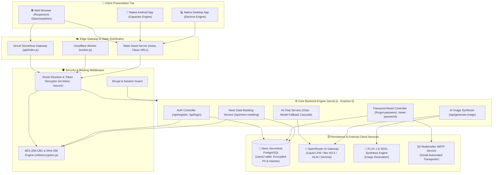
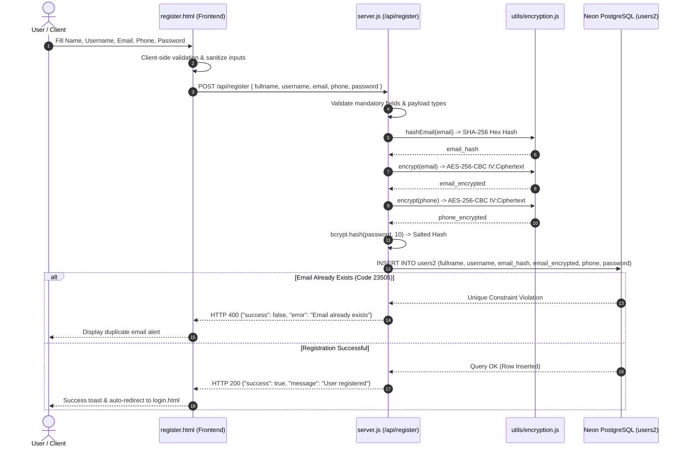
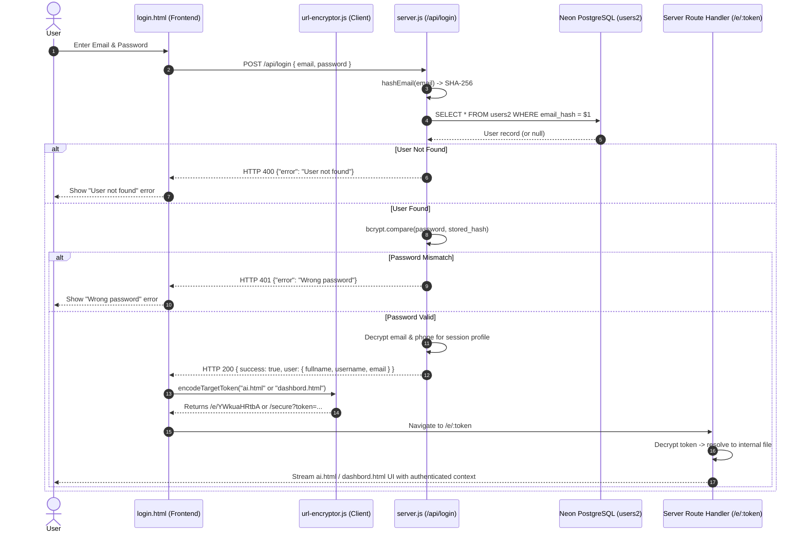
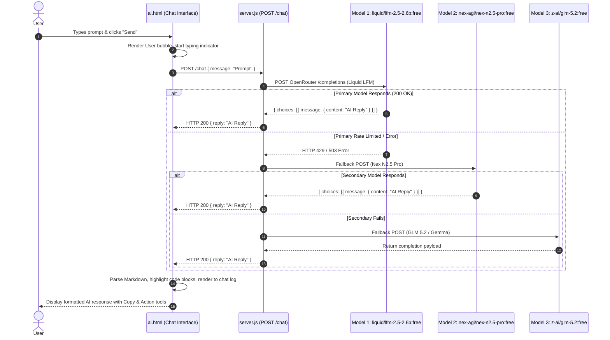
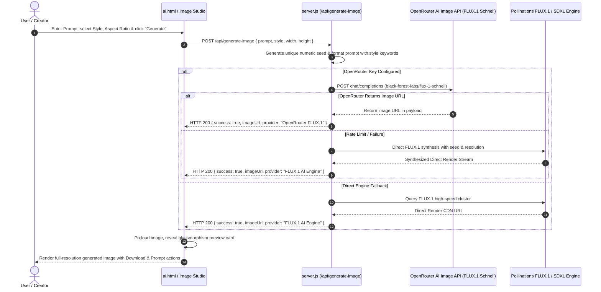
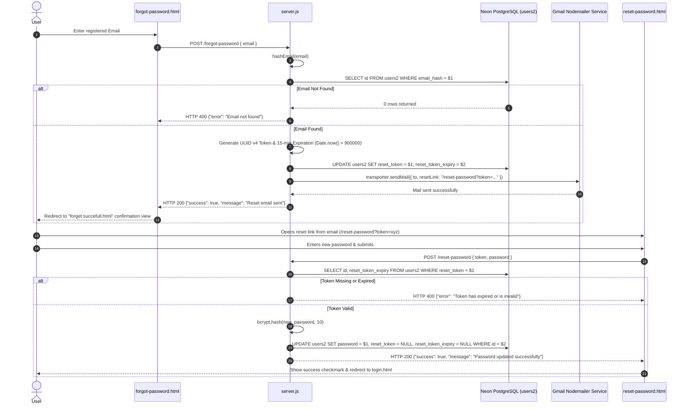
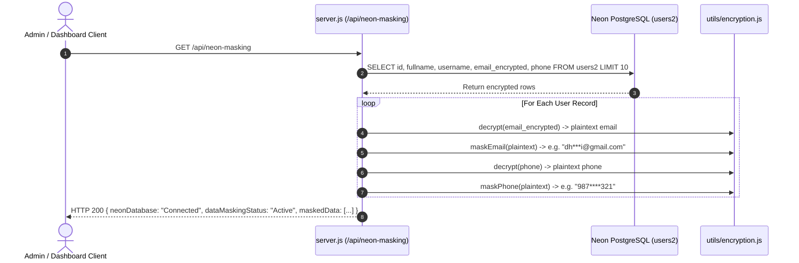
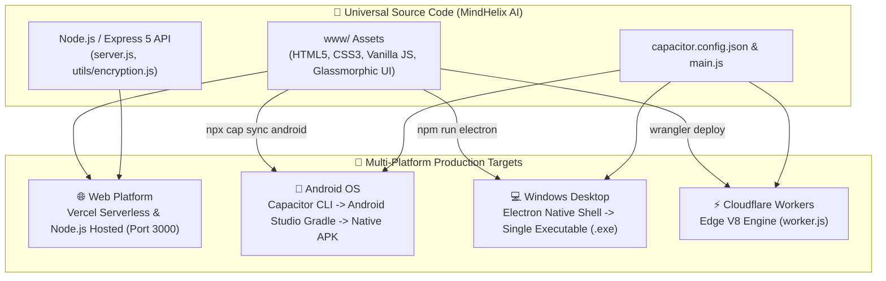

# 🧬 MindHelix AI — Complete System Architecture & Workflows

> **Document Version:** 2.0.0 (Production Blueprint)  
> **Target Platforms:** Web (Vercel / Node.js), Mobile (Capacitor Android), Desktop (Electron), Edge (Cloudflare Workers)  
> **Status:** Fully Integrated & Active

---

## 🏛️ 1. Master System Architecture Diagram

---

## 🔄 2. End-to-End System Workflows

### Workflow 1: User Registration, AES-256 Encryption & Data Storage

This workflow ensures zero-plaintext persistence for sensitive personal identifiable information (PII). Passwords are salt-hashed using bcrypt, emails are hashed via SHA-256 for O(1) duplicate checks and lookup indexing, and both email and phone numbers are encrypted with AES-256-CBC.

---

### Workflow 2: Secure Login & URL Token Obfuscation Navigation

MindHelix AI features an encrypted routing subsystem (`/e/:token` and `/secure?token=...`). Navigation destinations are obfuscated using Base64URL and AES-256 hashes to prevent direct page exposure and unauthorized manual tampering.

---

### Workflow 3: MindHelix AI Conversational Hub & Multi-Model Fallback Cascade

The AI Chat system integrates an automatic fault-tolerant multi-model fallback cascade. If the primary model encounters rate limits or upstream timeouts, the gateway automatically falls back to secondary and tertiary high-speed reasoning models.

---

### Workflow 4: AI Image Synthesis Pipeline (FLUX.1 & OpenRouter)

Users can prompt the image engine with style presets (Cinematic, Anime, Cyberpunk, 3D Render, etc.), dimensions, and seed control.

---

### Workflow 5: Forgot & Reset Password Lifecycle

---

### Workflow 6: Data Privacy & Neon Dynamic Data Masking

The system provides GDPR-compliant data masking via `/api/neon-masking` for administrative views, reporting, and secure audits.

---

## 🚀 3. Cross-Platform Compilation & Deployment Architecture

---

## 📋 4. Key Endpoints & Routing Matrix

| Route / Method | Handler | Purpose | Security / Encryption |
| :--- | :--- | :--- | :--- |
| `GET /` or `/home` | `sendFileSafe(home.html)` | Landing Page & Hero Section | Public |
| `GET /e/:token` | `resolveRouteFile(decoded)` | Obfuscated Route Navigation | Base64URL + AES-256 Decrypt |
| `GET /secure` | `resolveRouteFile(decrypt(token))`| Secure Parameter Navigation | AES-256-CBC Decrypt |
| `POST /api/register` | `server.js` | User Registration | SHA-256 Email Hash, AES-256 PII, Bcrypt Passwords |
| `POST /api/login` | `server.js` | User Authentication | SHA-256 Lookup, Bcrypt Compare, AES Decrypt Profile |
| `POST /chat` | `server.js` | MindHelix AI Conversational Hub | OpenRouter Multi-Model Fallback Cascade |
| `POST /api/generate-image` | `server.js` | AI Image Synthesis | OpenRouter FLUX Schnell + FLUX.1 Engine Fallback |
| `POST /forgot-password` | `server.js` | Reset Token Dispatch | UUID v4, 15-min TTL, Gmail Nodemailer |
| `POST /reset-password` | `server.js` | Password Overwrite | Token Expiry Validation, Bcrypt Re-hash |
| `GET /api/neon-masking`| `server.js` | Data Privacy Masking Audit | Decrypt -> Pattern Mask (`us***r@domain.com`) |
